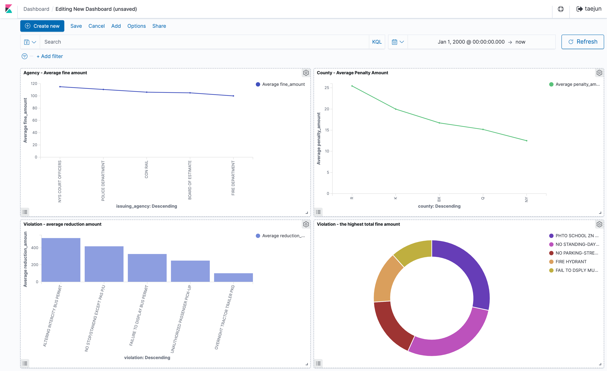

# NYC OPEN DATA ANALYSIS

New York City Government has collected parking and camera violation data, and has issued and updated it since 2016 in NYC Open Data. I analyzed this NYC Open Parking and Camera Violation dataset which includes 58.2 million rows and 19 columns.

I set up AWS EC2 to provision an Elasticsearch cluster.  I used Socrata Open Data API in a python script and created a docker image to push the dataset into the provisioned Elastisearch cluster.

I created data visualizations and put them on the dashboard to see at a glance. Those could be automatically updated by refreshing it during pushing all data.

## Usage
DOCKER IN TERMINAL
>docker build -t bigdata1:1.0 .
>
>docker run -v ${PWD}:/app -e DATASET_ID=“XXX” -e APP_TOKEN=“XXX” -e ES_HOST=“XXX” -e ES_USERNAME=“XXX” -e ES_PASSWORD=“XXX” bigdata1:1.0 –page_size=1000 –num_pages=1000

## File

****
